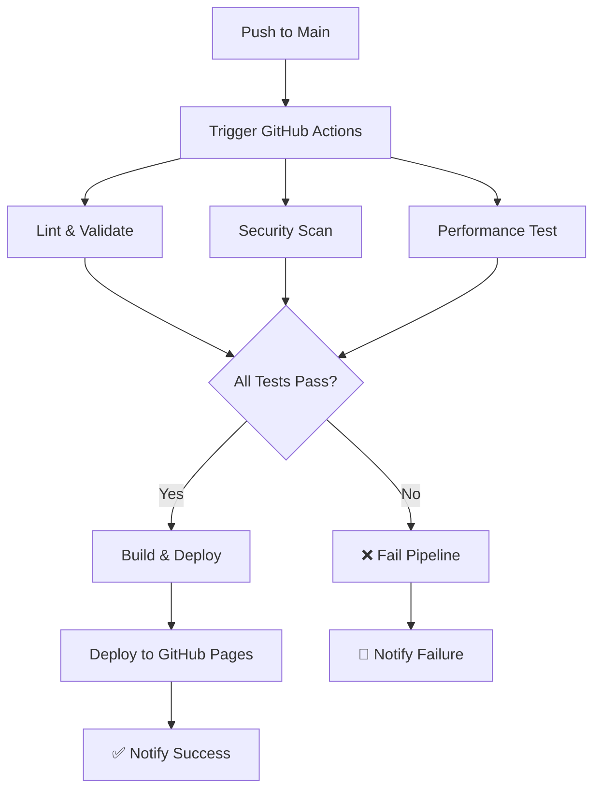

# 🚀 DevOps Pipeline Documentation
## CV Project - Ignacio Muñoz

### 📋 **Resumen del Pipeline**

Este proyecto implementa un pipeline completo de **CI/CD (Continuous Integration/Continuous Deployment)** para un CV profesional, demostrando prácticas modernas de DevOps en un contexto real y aplicable.

---

## 🏗️ **Arquitectura del Pipeline**



---

## 🔧 **Componentes del Pipeline**

### **1. 🔍 Lint & Validate**
- **HTMLHint**: Validación de sintaxis y estructura HTML
- **StyleLint**: Linting de CSS siguiendo estándares
- **Link Checker**: Verificación de enlaces rotos
- **Configuración**: `.htmlhintrc`, `.stylelintrc.json`

### **2. 🛡️ Security Scan**
- **Trivy**: Escaneo de vulnerabilidades de seguridad
- **SARIF Upload**: Integración con GitHub Security Advisor
- **Reportes**: Almacenados en GitHub Security tab

### **3. 📊 Performance Test**
- **Lighthouse CI**: Auditoría automática de performance
- **Métricas evaluadas**: Performance, Accessibility, SEO, Best Practices
- **Umbrales mínimos**: 80% performance, 90% accessibility
- **Configuración**: `lighthouserc.js`

### **4. 🚀 Build & Deploy**
- **Artifact Generation**: Creación de build optimizado
- **GitHub Pages**: Deploy automático
- **Build Info**: Metadata de cada deploy (fecha, commit, branch)

---

## 📁 **Estructura de Archivos DevOps**

```
.github/
└── workflows/
    └── ci-cd.yml           # Pipeline principal
.htmlhintrc                 # Configuración HTML linting
.stylelintrc.json          # Configuración CSS linting
lighthouserc.js            # Configuración Lighthouse CI
README.md                  # Documentación general
PIPELINE.md                # Este archivo
PRINT_GUIDE.md            # Guía de impresión PDF
```

---

## ⚙️ **Jobs del Pipeline**

### **Job 1: `lint-and-validate`**
```yaml
# Ejecuta en: ubuntu-latest
# Dependencias: Node.js 18
# Duración estimada: 1-2 minutos
```
- Instala herramientas de linting
- Valida sintaxis HTML
- Verifica estándares CSS
- Busca enlaces rotos

### **Job 2: `security-scan`**
```yaml
# Ejecuta en: ubuntu-latest
# Herramienta: Trivy Scanner
# Duración estimada: 30-60 segundos
```
- Escanea vulnerabilidades en código
- Genera reporte SARIF
- Sube resultados a GitHub Security

### **Job 3: `performance-test`**
```yaml
# Ejecuta en: ubuntu-latest
# Herramienta: Lighthouse CI
# Duración estimada: 1-2 minutos
```
- Inicia servidor local
- Ejecuta auditoría Lighthouse
- Evalúa métricas contra umbrales

### **Job 4: `build-and-deploy`**
```yaml
# Ejecuta en: ubuntu-latest
# Dependencias: jobs anteriores exitosos
# Duración estimada: 1-2 minutos
```
- Construye artefactos optimizados
- Genera información de build
- Despliega a GitHub Pages

### **Job 5: `notify`**
```yaml
# Ejecuta en: ubuntu-latest
# Condición: always()
# Duración estimada: < 30 segundos
```
- Notifica resultado del deploy
- Proporciona URL del CV actualizado

---

## 🎯 **Triggers del Pipeline**

### **Automáticos:**
- ✅ `push` a rama `main`
- ✅ `pull_request` hacia `main`

### **Manuales:**
- ✅ `workflow_dispatch` (botón en GitHub Actions)

---

## 📊 **Métricas y Umbrales**

### **Lighthouse CI Thresholds:**
```javascript
assertions: {
  'categories:performance': ['error', {minScore: 0.8}],    // 80%
  'categories:accessibility': ['error', {minScore: 0.9}],  // 90%
  'categories:best-practices': ['error', {minScore: 0.8}], // 80%
  'categories:seo': ['error', {minScore: 0.8}],           // 80%
}
```

### **HTML/CSS Quality Gates:**
- Sin errores de sintaxis HTML
- Cumplimiento de estándares CSS
- Enlaces válidos y accesibles

---

## 🔒 **Seguridad y Permisos**

### **GitHub Actions Permissions:**
```yaml
permissions:
  contents: read          # Leer código fuente
  pages: write           # Escribir a GitHub Pages
  id-token: write        # Token para Pages
  security-events: write # Subir reportes de seguridad
```

### **Secrets Utilizados:**
- `GITHUB_TOKEN`: Token automático de GitHub
- `LHCI_GITHUB_APP_TOKEN`: Para Lighthouse CI

---

## 📈 **Beneficios Implementados**

### **Para el Desarrollo:**
- ✅ **Quality Gates**: No deploy si hay errores
- ✅ **Automated Testing**: Validación en cada cambio
- ✅ **Performance Monitoring**: Métricas automáticas
- ✅ **Security Scanning**: Detección temprana de vulnerabilidades

### **Para el Negocio:**
- ✅ **Zero Downtime**: Deploy automático sin interrupciones
- ✅ **Rollback Capability**: Historial de deployments
- ✅ **Consistent Quality**: Estándares automatizados
- ✅ **Professional Image**: CV siempre actualizado

### **Para DevOps Learning:**
- ✅ **Real CI/CD Pipeline**: Experiencia práctica
- ✅ **Modern Tools**: GitHub Actions, Lighthouse, Trivy
- ✅ **Best Practices**: Linting, testing, security
- ✅ **Documentation**: Código y procesos documentados

---

## 🚨 **Troubleshooting**

### **Pipeline Fails en Linting:**
```bash
# Verificar localmente:
npx htmlhint index.html
npx stylelint "**/*.css"
```

### **Performance Test Fails:**
- Verificar que el contenido cargue en < 3 segundos
- Revisar optimización de imágenes
- Validar accesibilidad

### **Deploy Fails:**
- Verificar permisos de GitHub Pages
- Confirmar que rama `main` esté protegida correctamente

---

## 📚 **Comandos Útiles**

### **Desarrollo Local:**
```bash
# Instalar dependencias
npm install

# Linting local
npm run lint

# Servidor local
python -m http.server 8080
```

### **Git Workflow:**
```bash
# Crear feature branch
git checkout -b feature/nueva-seccion

# Desarrollo...
git add .
git commit -m "feat: nueva sección de proyectos"

# Push y crear PR
git push origin feature/nueva-seccion
```

---

## 🎓 **Aprendizajes DevOps Demostrados**

1. **Infrastructure as Code**: Pipeline completamente versionado
2. **Continuous Integration**: Testing automático en cada commit
3. **Continuous Deployment**: Deploy automático a producción
4. **Quality Assurance**: Gates de calidad automatizados
5. **Security**: Scanning y monitoreo continuo
6. **Monitoring**: Métricas de performance automáticas
7. **Documentation**: Procesos completamente documentados

---

## 🔗 **Enlaces Importantes**

- **Repository**: [github.com/ignazer/CV_IMG](https://github.com/ignazer/CV_IMG)
- **Live CV**: [ignazer.github.io/CV_IMG](https://ignazer.github.io/CV_IMG)
- **Pipeline**: [github.com/ignazer/CV_IMG/actions](https://github.com/ignazer/CV_IMG/actions)
- **Security**: [github.com/ignazer/CV_IMG/security](https://github.com/ignazer/CV_IMG/security)

---

*Este pipeline demuestra competencias prácticas en DevOps, CI/CD, y automatización - skills esenciales para roles de DevOps Engineer, Cloud Support, y Site Reliability Engineer.*
