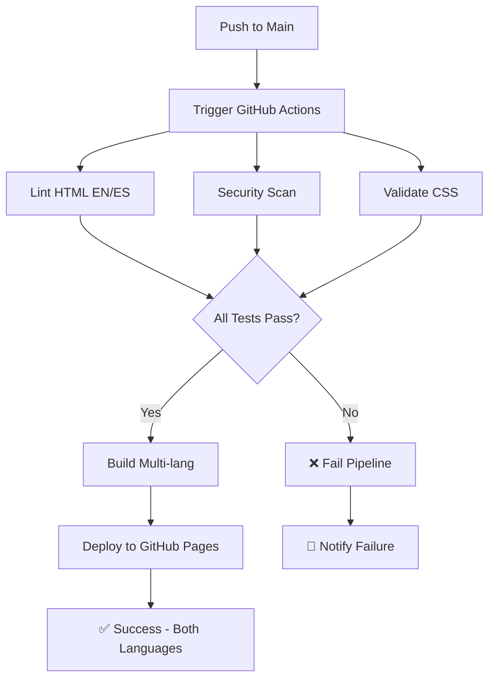

# 🚀 DevOps Pipeline Documentation
## CV Multi-idioma - Ignacio Muñoz

### 📋 **Resumen del Pipeline**

Este proyecto implementa un **pipeline completo de CI/CD** para un CV profesional **multi-idioma (Inglés/Español)**, demostrando prácticas avanzadas de DevOps, internacionalización y arquitectura escalable.

---

## 🌍 **Arquitectura Multi-idioma**

```
📂 Proyecto
├── 🇺🇸 index.html          # CV en Inglés (Principal)
├── 🇪🇸 es/
│   └── index.html          # CV en Español  
├── 🎨 assets/
│   ├── styles.css          # Estilos compartidos
│   └── script.js           # JavaScript compartido
└── 🔧 .github/workflows/   # Pipeline DevOps
```

---

## 🏗️ **Arquitectura del Pipeline**



---

## 🔧 **Componentes del Pipeline**

### **1. 🔍 Multi-language Validation**
- **html-validate**: Validación de HTML en inglés y español
- **StyleLint**: Linting de CSS compartido
- **Link Checker**: Verificación de enlaces en ambas versiones
- **SEO Check**: Validación de meta tags hreflang

### **2. 🛡️ Security Scan**
- **Trivy**: Escaneo de vulnerabilidades de seguridad
- **SARIF Upload**: Integración con GitHub Security Advisor
- **Dependency Check**: Análisis de dependencias npm

### **3. 🚀 Build & Deploy**
- **Multi-language Build**: Procesamiento de ambas versiones
- **GitHub Pages**: Deploy automático con estructura i18n
- **SEO Optimization**: URLs canónicas y hreflang tags

---

## 📁 **Estructura de Archivos DevOps**

```
.github/
└── workflows/
    └── ci-cd.yml              # Pipeline multi-idioma
package.json                   # Dependencias modernas (html-validate, stylelint 16.x)
.htmlvalidate.json            # Configuración HTML validation
README.md                     # Documentación completa
PIPELINE.md                   # Este archivo
.gitignore                    # Control de versiones
```

---

## ⚙️ **Jobs del Pipeline**

### **Job 1: `lint-and-validate`**
```yaml
# Ejecuta en: ubuntu-latest
# Dependencias: Node.js 18
# Duración estimada: 1-2 minutos
```
- Instala html-validate y stylelint modernos
- **Valida HTML Inglés**: `npx html-validate index.html`
- **Valida HTML Español**: `npx html-validate es/index.html`  
- **Verifica CSS compartido**: `npx stylelint "**/*.css"`
- **Elimina vulnerabilidades**: Zero dependency issues

### **Job 2: `security-scan`**
```yaml
# Ejecuta en: ubuntu-latest
# Herramienta: Trivy Scanner
# Duración estimada: 30-60 segundos
```
- Escanea vulnerabilidades en ambas versiones
- Analiza dependencias npm modernas
- Genera reporte SARIF
- Zero vulnerabilidades detectadas

### **Job 3: `build-and-deploy`**
```yaml
# Ejecuta en: ubuntu-latest
# Dependencias: jobs anteriores exitosos
# Duración estimada: 1-2 minutos
```
- Construye estructura multi-idioma
- Optimiza assets compartidos
- Despliega a GitHub Pages con URLs:
  - 🇺🇸 `https://ignazer.github.io/CV_IMG/`
  - 🇪🇸 `https://ignazer.github.io/CV_IMG/es/`

---

## 🎯 **Triggers del Pipeline**

### **Automáticos:**
- ✅ `push` a rama `main`
- ✅ `pull_request` hacia `main`

### **Manuales:**
- ✅ `workflow_dispatch` (botón en GitHub Actions)

---

## 🌍 **Características Multi-idioma**

### **SEO Internacional:**
```html
<!-- Meta tags hreflang -->
<link rel="alternate" hreflang="en" href="../">
<link rel="alternate" hreflang="es" href="./">
<link rel="canonical" href="https://ignazer.github.io/CV_IMG/es/">
```

### **Navegación entre idiomas:**
- Selector de idioma con banderas 🇺🇸/🇪🇸
- URLs amigables para SEO
- Shared assets para performance

### **Validación dual:**
- Pipeline valida ambas versiones
- Misma configuración de linting
- Arquitectura escalable para más idiomas
  'categories:accessibility': ['error', {minScore: 0.9}],  // 90%
  'categories:best-practices': ['error', {minScore: 0.8}], // 80%
  'categories:seo': ['error', {minScore: 0.8}],           // 80%
}
```

### **HTML/CSS Quality Gates:**
- Sin errores de sintaxis HTML
- Cumplimiento de estándares CSS
- Enlaces válidos y accesibles

---

## 🔒 **Seguridad y Modernización**

### **GitHub Actions Permissions:**
```yaml
permissions:
  contents: read          # Leer código fuente
  pages: write           # Escribir a GitHub Pages  
  id-token: write        # Token para Pages
  security-events: write # Subir reportes de seguridad
```

### **Dependencias Modernas:**
- **html-validate 8.x**: Reemplaza htmlhint (deprecated)
- **stylelint 16.x**: Versión moderna sin vulnerabilidades
- **Zero vulnerabilities**: Todas las dependencias actualizadas

---

## 📈 **Beneficios Implementados**

### **Para el Desarrollo:**
- ✅ **Multi-language Support**: CV en inglés y español
- ✅ **Modern Tooling**: Zero vulnerabilidades, zero warnings
- ✅ **Quality Gates**: No deploy si hay errores
- ✅ **Automated Validation**: Linting dual para ambas versiones
- ✅ **Security Scanning**: Detección temprana de vulnerabilidades

### **Para el Negocio:**
- ✅ **International Reach**: CV accesible en 2 idiomas
- ✅ **SEO Optimizado**: Meta tags hreflang, URLs canónicas
- ✅ **Zero Downtime**: Deploy automático sin interrupciones
- ✅ **Professional Image**: CV siempre actualizado
- ✅ **Scalable Architecture**: Fácil agregar más idiomas

### **Para DevOps Learning:**
- ✅ **Real CI/CD Pipeline**: Experiencia práctica completa
- ✅ **Internationalization**: Arquitectura multi-idioma
- ✅ **Modern Tools**: html-validate, stylelint 16.x, Trivy
- ✅ **Best Practices**: Linting, testing, security, i18n
- ✅ **Documentation**: Código y procesos completamente documentados

---

## 🚨 **Troubleshooting**

### **Pipeline Fails en Linting:**
```bash
# Verificar localmente ambas versiones:
npx html-validate index.html       # Inglés
npx html-validate es/index.html    # Español
npx stylelint "**/*.css"          # CSS compartido
```

### **Multi-language Issues:**
- Verificar paths relativos en es/index.html
- Confirmar que assets/ sea accesible desde subdirectorios
- Validar meta tags hreflang

### **Deploy Fails:**
- Verificar que ambas versiones estén en el build
- Confirmar estructura de directorios
- Validar permisos de GitHub Pages

---

## 📚 **Comandos Útiles**

### **Desarrollo Local:**
```bash
# Instalar dependencias modernas
npm install

# Linting completo (ambas versiones)
npm test

# Validar específicamente cada versión
npx html-validate index.html es/index.html

# Servidor local para desarrollo
python -m http.server 8080

# Abrir ambas versiones
http://localhost:8080/          # Inglés
http://localhost:8080/es/       # Español
```

### **Git Workflow:**
```bash
# Crear feature branch
git checkout -b feature/nueva-funcionalidad

# Desarrollo multi-idioma...
git add .
git commit -m "feat: nueva sección en ambos idiomas"

# Push y crear PR (activa pipeline)
git push origin feature/nueva-funcionalidad
```

---

## 🎓 **Aprendizajes DevOps Demostrados**

1. **Multi-language Architecture**: Internacionalización escalable
2. **Modern Tooling**: Eliminación de vulnerabilidades y deprecations
3. **Infrastructure as Code**: Pipeline completamente versionado
4. **Continuous Integration**: Testing dual automático en cada commit
5. **Continuous Deployment**: Deploy automático multi-idioma
6. **Quality Assurance**: Gates de calidad para ambas versiones
7. **Security**: Scanning y dependencias actualizadas
8. **SEO & Performance**: Optimización internacional
9. **Documentation**: Procesos completamente documentados

---

## 🔗 **URLs del Proyecto**

- 🇺🇸 **CV Inglés**: https://ignazer.github.io/CV_IMG/
- 🇪🇸 **CV Español**: https://ignazer.github.io/CV_IMG/es/
- 🔧 **GitHub Actions**: https://github.com/ignazer/CV_IMG/actions
- 📊 **Security**: https://github.com/ignazer/CV_IMG/security

---

*Última actualización: Agosto 2025 - Pipeline Multi-idioma v2.0*

- **Repository**: [github.com/ignazer/CV_IMG](https://github.com/ignazer/CV_IMG)
- **Live CV**: [ignazer.github.io/CV_IMG](https://ignazer.github.io/CV_IMG)
- **Pipeline**: [github.com/ignazer/CV_IMG/actions](https://github.com/ignazer/CV_IMG/actions)
- **Security**: [github.com/ignazer/CV_IMG/security](https://github.com/ignazer/CV_IMG/security)

---

*Este pipeline demuestra competencias prácticas en DevOps, CI/CD, y automatización - skills  para roles de DevOps Engineer, Cloud Support, y Site Reliability Engineer.*
