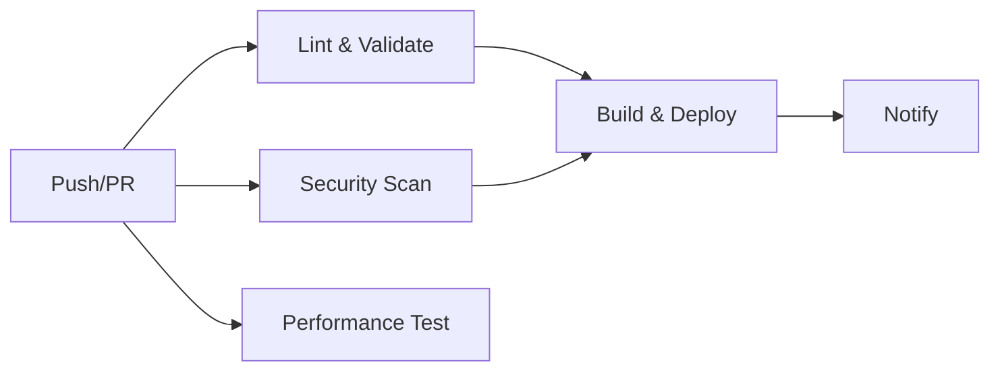

# CV DevOps Pipeline

Este repositorio contiene mi CV personal con un pipeline CI/CD completo implementado con GitHub Actions.

## 🚀 Características del Pipeline

### ✅ **Validación y Linting**
- **HTMLHint**: Validación de sintaxis HTML
- **StyleLint**: Linting de CSS
- **Link Checker**: Verificación de enlaces rotos

### 🛡️ **Security Scanning**
- **Trivy**: Escaneo de vulnerabilidades
- **SARIF Upload**: Integración con GitHub Security

### 📊 **Performance Testing**
- **Lighthouse CI**: Auditoría de performance, accesibilidad y SEO
- **Umbrales automáticos**: Falla si no cumple estándares mínimos

### 🚀 **Deploy Automático**
- **GitHub Pages**: Deploy automático en cada push a main
- **Build Info**: Información de build y commit en cada deploy
- **Artifact Upload**: Gestión profesional de builds

## 🔄 **Workflow**



## 📂 **Estructura del Proyecto**

```
├── .github/
│   └── workflows/
│       └── ci-cd.yml          # Pipeline principal
├── index.html                 # CV principal
├── .htmlhintrc               # Configuración HTML linting
├── .stylelintrc.json         # Configuración CSS linting
├── lighthouserc.js           # Configuración Lighthouse
└── README.md                 # Este archivo
```

## 🎯 **Beneficios DevOps Demostrados**

1. **Continuous Integration**: Validación automática en cada commit
2. **Continuous Deployment**: Deploy automático a producción
3. **Quality Gates**: No deploy si fallan las validaciones
4. **Security First**: Escaneo automático de vulnerabilidades
5. **Performance Monitoring**: Auditorías automáticas de rendimiento
6. **Infrastructure as Code**: Todo el pipeline está versionado

## 🌐 **URL del CV**

El CV está disponible en: `https://ignazer.github.io/CV_IMG`

## 🛠️ **Comandos Locales**

```bash
# Instalar dependencias
npm install

# Linting local
npx htmlhint index.html
npx stylelint "**/*.css"

# Servidor local
python -m http.server 8080
```

---

*Este proyecto demuestra la implementación de prácticas DevOps modernas en un contexto simple pero profesional.*
