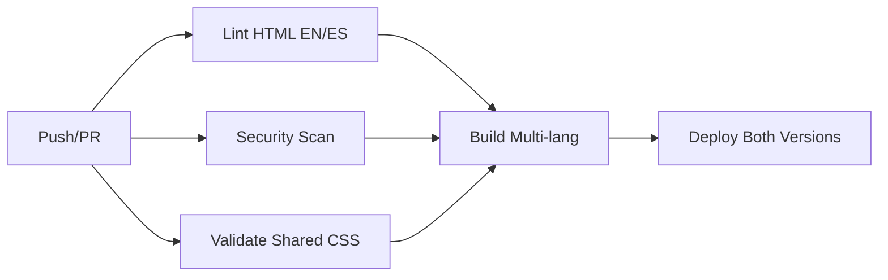

# 🌍 CV Multi-idioma DevOps Pipeline

Este repositorio contiene mi CV profesional **multi-idioma (Inglés/Español)** con un pipeline CI/CD completo implementado con GitHub Actions, demostrando prácticas avanzadas de DevOps e internacionalización.

## 🚀 Características del Pipeline

### ✅ **Multi-language Validation**
- **html-validate**: Validación moderna de HTML en inglés y español
- **StyleLint 16.x**: Linting de CSS compartido sin vulnerabilidades
- **Zero Dependencies Issues**: Todas las herramientas actualizadas

### 🛡️ **Security & Modern Tooling**
- **Trivy**: Escaneo de vulnerabilidades
- **Modern Dependencies**: Eliminación completa de deprecated packages
- **SARIF Upload**: Integración con GitHub Security

### 🌍 **International Architecture**
- **Dual Language Support**: CV disponible en inglés y español
- **SEO Optimization**: Meta tags hreflang y URLs canónicas
- **Shared Assets**: Arquitectura optimizada con recursos compartidos

### 🚀 **Deploy Automático**
- **GitHub Pages**: Deploy automático multi-idioma
- **SEO URLs**: Estructura amigable para motores de búsqueda
- **Build Validation**: Linting dual antes de cada deploy

## 🔄 **Workflow Multi-idioma**



## 📂 **Estructura del Proyecto**

```
├── .github/
│   └── workflows/
│       └── ci-cd.yml          # Pipeline multi-idioma
├── 🇺🇸 index.html             # CV en Inglés
├── 🇪🇸 es/
│   └── index.html             # CV en Español
├── 🎨 assets/
│   ├── styles.css             # Estilos compartidos
│   └── script.js              # JavaScript compartido
├── package.json               # Dependencias modernas
├── .htmlvalidate.json         # Configuración html-validate
├── PIPELINE.md                # Documentación técnica detallada
└── README.md                  # Este archivo
```

## 🎯 **Beneficios DevOps Demostrados**

1. **Multi-language CI/CD**: Validación automática dual (EN/ES)
2. **Modern Tooling**: Zero vulnerabilidades, zero deprecated packages
3. **International Architecture**: Escalable para múltiples idiomas
4. **Quality Gates**: No deploy si fallan las validaciones duales
5. **Security First**: Escaneo automático y dependencias actualizadas
6. **SEO Optimization**: Meta tags hreflang y estructura internacional
7. **Infrastructure as Code**: Pipeline multi-idioma completamente versionado

## 🌐 **URLs del CV**

- 🇺🇸 **Inglés**: https://ignazer.github.io/CV_IMG/
- 🇪🇸 **Español**: https://ignazer.github.io/CV_IMG/es/

## 🛠️ **Comandos Locales**

```bash
# Instalar dependencias modernas
npm install

# Linting completo (ambas versiones)
npm test

# Validación específica
npx html-validate index.html es/index.html  # Dual HTML
npx stylelint "**/*.css"                   # CSS compartido

# Servidor local para desarrollo
python -m http.server 8080
# http://localhost:8080/     -> Inglés
# http://localhost:8080/es/  -> Español
```

## 📊 **Pipeline Status**

[](https://github.com/ignazer/CV_IMG/actions/workflows/ci-cd.yml)

- ✅ **Linting**: html-validate + stylelint 16.x
- ✅ **Security**: Trivy scanner - Zero vulnerabilities
- ✅ **Multi-language**: Validación dual EN/ES
- ✅ **Deploy**: GitHub Pages automático

## 🎓 **Tecnologías DevOps Utilizadas**

- **CI/CD**: GitHub Actions
- **Linting**: html-validate, stylelint 16.x
- **Security**: Trivy vulnerability scanner
- **Deploy**: GitHub Pages
- **Architecture**: Multi-language with shared assets
- **SEO**: International optimization with hreflang

---
